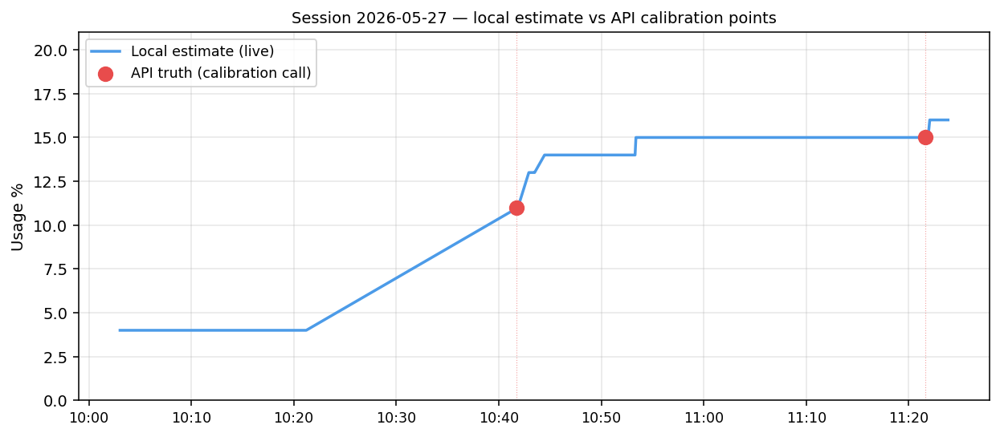

# Claude Usage Widget

A lightweight Python alternative to the other Claude usage widgets — with
**live updates** and a **CLI mode**.

> **⚠️ Beta (v0.1.0).** This is a newly published, early release — testers
> greatly appreciated. Please [report any bugs](../../issues) and I'll fix
> things promptly.

Shows your Claude.ai session and weekly usage, along with your remaining time in
session, as system tray icons — so you can see at a glance what you'd get from
opening the usage page.

The reading updates **continuously as you work**: driven by Claude Code token
counts from your local transcripts, calibrated against less frequent calls to the
claude.ai usage page using your Firefox cookies.

> The underlying usage calculator and CLI (`usage_check.py`) are cross-platform,
> but only thoroughly tested on Windows so far (this will change soon!). The tray
> icons are currently Windows-only; macOS and Linux are planned — see
> [Platform support](#platform-support).

## Features

- **Continuously updating** — the live number moves as you send messages, driven by local Claude Code token counts, not by a slow refresh timer.
- **Time left in your session** — tooltip shows the countdown to your next reset (`resets in 2h 50m`).
- **Session and weekly usage** — both Pro/Max windows, not just one.
- **CLI mode** — `usage_check.py --json` for Claude Code and programmatic access.
- **Tray-native** — customisable widgets that display the data clearly, right in your system tray.

---

## Check your usage from the terminal

For Claude Code and programmatic access — query usage mid-task or pipe it into scripts:

```
python usage_check.py            # show widget's current estimate (no network)
python usage_check.py --live     # fetch authoritative numbers from claude.ai
python usage_check.py --json     # machine-readable JSON (works with both)
```

`--live` hits the same endpoint Claude Code uses when it reports "X% of your session used", so the numbers match exactly.
This works on any OS where Python and Firefox are installed — no tray required.

---

## What it tracks — and what it doesn't

The widget combines two sources:

- **Live estimate:** counts tokens from Claude Code transcripts on **this device** in real time, so the reading moves as you work.
- **Calibration:** polls `claude.ai` for your actual Pro/Max utilisation percentage and corrects any drift. Calibration calls are no more than 20 minutes apart by default, with extra calls made at startup and during early-session anchoring. Set `poll_interval_minutes` in `config.json` (or the `CLAUDE_POLL_INTERVAL_MINUTES` env var) to change the cadence.

**Live updates do not see:**
- Usage from other devices
- Claude.ai web chat usage
- Claude Code usage on other devices

Those are picked up on the next calibration call (no more than 20 minutes apart by default, configurable), but the live estimate in between only reflects this device's Claude Code transcript activity.

---

## Accuracy

While calibration improvements are coming to make the live estimate more reliable in edge cases, a typical session's output should be pretty accurate if you're only using Claude on your current device. Here's a real session:



The widget keeps a log of these comparisons in `calibration.jsonl` (see `plot_drift.py` to visualise your own sessions). Prettier in-app tracking is coming — see [Coming features](#coming-features).

---

## Setup

### Option A — prebuilt (no Python needed, Windows only)

1. Download the latest `ClaudeUsage-win64.zip` from the [Releases page](../../releases).
2. Unzip anywhere.
3. Make sure you're logged in to [claude.ai](https://claude.ai) in **Firefox** (see [Browser support](#browser-support) below).
4. Double-click `ClaudeUsage.exe`.

The org ID and session cookie are auto-detected from your Firefox session — no configuration needed in most cases.

### Option B — from source

```
git clone <this-repo>
cd ClaudeUsageWidget
pip install -r requirements.txt
python tray_widget.py
```

Make sure you're logged in to [claude.ai](https://claude.ai) in **Firefox** before running.

### Finding your org ID (fallback only)

The widget auto-detects your org ID from your browser session.
If auto-detection fails, you can find it manually:

1. Open <https://claude.ai/settings/usage> in your browser.
2. Open DevTools → Network tab → reload the page.
3. Look for a request to `/api/organizations/<UUID>/usage`. Copy the UUID.
4. Either:
   - Set the environment variable `CLAUDE_ORG_ID=<your-uuid>`, or
   - Copy `config.example.json` to `config.json` and fill in `org_id`.

---

## Making the icon always visible

### Start at login

The tray menu has a **"Start at login"** toggle. Alternatively, copy the shortcut manually:

1. Press `Win+R`, type `shell:startup`, press Enter.
2. Copy a shortcut to `ClaudeUsage.exe` into that folder.

### Pin it to the taskbar tray (un-hide the icon)

Windows hides new tray icons under the `^` overflow by default. To keep it visible:

1. **Settings → Personalization → Taskbar**
2. Scroll to **"Other system tray icons"**
3. Toggle **"Claude Usage"** on.

---

## Browser support

The widget reads your session cookie directly from your Firefox's local cookie store.

**Why only Firefox:** Since Chrome 127 (July 2024), Chromium-based browsers use App-Bound Encryption to protect cookies. The decryption key is bound to the signed browser binary via a SYSTEM-privilege helper service, so external processes (like this widget) can't access it. This is a deliberate security feature, not a bug we can work around without invasive techniques we're not willing to ship. Firefox uses a different mechanism (NSS) that remains accessible.

You don't need to use Firefox as your default browser — just being logged in to [claude.ai](https://claude.ai) there is enough.

---

## Platform support

| Platform | Tray widget | `usage_check.py` |
|----------|-------------|-----------------|
| Windows  | Yes (prebuilt exe + source) | Yes |
| macOS    | Not packaged yet | Yes (Python + browser) |
| Linux    | Not packaged yet | Yes (Python + browser) |

On macOS/Linux, `python usage_check.py --live` works anywhere Python and Firefox are installed.
The tray and packaging haven't been shipped for non-Windows platforms yet, but the core is cross-platform.

---

## Coming features

Planned, not yet shipped:

- **macOS & Linux packaging** — the core already runs cross-platform (see above); only the tray packaging is Windows-only today.
- **Configurable widgets** — custom icons, per-widget colours, per-threshold colour changes, and a settings window.
- **Extra usage** — surface pay-as-you-go / overage usage beyond your plan's included limits, alongside the session and weekly readings.
- **Improved early-session calibration** — replace the back-derived budget with a recency-weighted prior plus delta-calibration that detects off-laptop usage, so the estimate is accurate from the first minutes of a session and can't overshoot 100%. Design in [`CALIBRATION-PLAN.md`](CALIBRATION-PLAN.md).
- **Per-model weighting** — weight tokens by model when computing usage (an Opus token costs more against the limit than a Sonnet/Haiku one); today the estimate counts raw input + output tokens unweighted.
- **Usage history and drift tracking** — in-app visualisation of how your usage estimate tracks against the API over time, surfacing the data already logged in `calibration.jsonl`.

---

## Risks — read before using

**UNOFFICIAL — NOT affiliated with Anthropic.** This tool works by replaying
your logged-in browser session cookie against an **undocumented** `claude.ai`
endpoint. Anthropic's vagueness about per-session token limits may be
intentional, and they may not welcome a tool that surfaces it. **Use at your
own risk, including the risk of account action.** Decide for yourself whether
that tradeoff is worth it.

(For what it's worth, once calibrated, the endpoint is only called every 20 minutes by default while providing live estimates using local token counts from your transcripts. Treat that as a property of the design, not a safety guarantee.)

---

## License

MIT — see [LICENSE](LICENSE).
