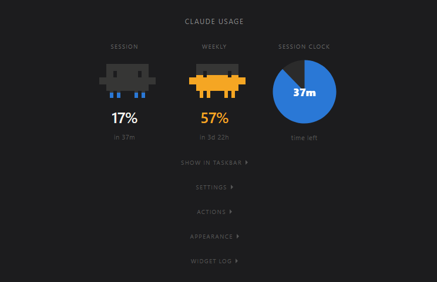
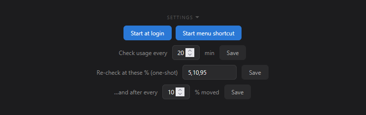
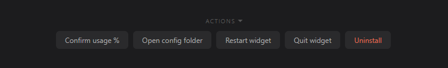
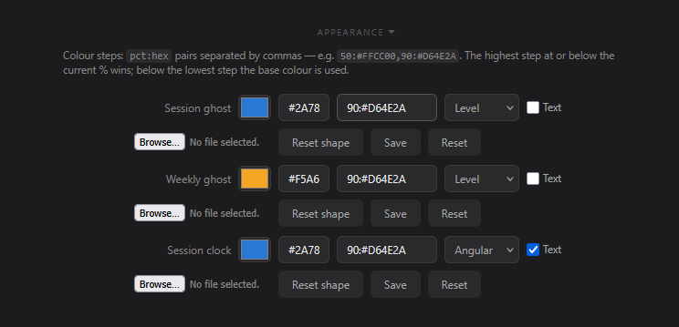
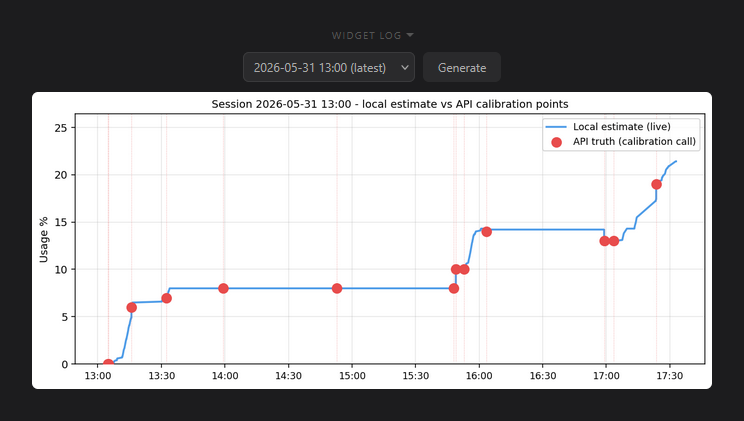
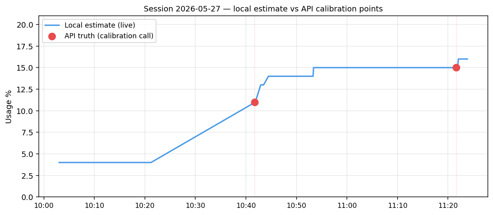

# Claude Usage Widget

**v0.1.0-alpha** · Windows · Python · MIT

A lightweight tray widget for Claude Pro/Max users that shows your session and weekly usage *live* — updating as you send messages, not just when you open a browser tab.


> **Unofficial — not affiliated with Anthropic.** Reads your usage via an undocumented `claude.ai` endpoint. See [Risks](#risks) before using.

---

## Why this one

Most usage trackers poll the API on a timer and show you a number. This one:

- **Moves between polls** — token counts from your local Claude Code transcripts drive a live estimate that updates the moment you send a message.
- **No Electron** — a small Python process with system tray icons; no browser window to keep open.
- **CLI access** — `usage_check.py` gives you the current reading from any terminal or script.
- **HTML dashboard** — a local browser UI for settings, icon customisation, and a usage graph.

---

## Screenshots

### System tray


Left to right: session usage (ghost fill), weekly usage (ghost fill), time left in session (arc). All three update live.

### Dashboard

Open the HTML dashboard by right-clicking any tray icon → **Open dashboard** (or navigate to `http://localhost:7433` while the widget is running).



<details>
<summary>Show in taskbar</summary>


Toggle which icons appear in your tray. You can hide any you don't use.
</details>

<details>
<summary>Settings</summary>



- **Start at login** — adds a Startup shortcut so the widget launches with Windows.
- **Start menu shortcut** — optional shortcut in the Windows Start menu.
- **Check usage every N min** — how often to poll `claude.ai` for the authoritative %. Default 20 min; lower values use more API calls against the undocumented endpoint.
- **Re-check at these %** — one-shot extra polls at specific thresholds (e.g. `5,10,95`).
- **…and after every % moved** — delta trigger: re-poll whenever the estimate moves by this many points.
</details>

<details>
<summary>Actions</summary>



- **Confirm usage %** — force an immediate poll and re-anchor the estimate.
- **Open config folder** — opens the folder containing `config.json` and the usage logs in Explorer.
- **Restart widget** — restart in place.
- **Quit** — exit cleanly.
- **Uninstall** — removes Startup and Start menu shortcuts, then quits.
</details>

<details>
<summary>Appearance</summary>



Per-widget controls for all three icons:

- **Base colour** — the colour when usage is low.
- **Colour stops** — threshold overrides, e.g. `50:#FFCC00,90:#D64E2A` turns yellow at 50%, red at 90%.
- **Fill mode** — *Level* (fills bottom-to-top) or *Angular* (sweeps clockwise like a gauge).
- **Text** — toggle the percentage overlay on the ghost icons.
- **Custom shape** — upload your own SVG or raster image to replace the ghost silhouette.
</details>

<details>
<summary>Widget log</summary>


Select a past session from the dropdown and hit **Generate** to plot the local estimate against API calibration points for that session. Useful for checking how closely the widget tracked your actual usage.


</details>

---

## Setup

### Option A — prebuilt (Windows, no Python needed)

1. Download `ClaudeUsage-win64.zip` from the [Releases page](../../releases).
2. Unzip anywhere.
3. Log in to [claude.ai](https://claude.ai) in **Firefox** (see [Browser support](#browser-support)).
4. Double-click `ClaudeUsage.exe`.

The widget auto-detects your org ID and session cookie from Firefox — no configuration needed.

### Option B — from source

```
git clone <this-repo>
cd ClaudeUsageWidget
pip install -r requirements.txt
python tray_widget.py
```

Requires Firefox logged in to [claude.ai](https://claude.ai).

---

## CLI

For scripting, Claude Code hooks, or checking usage mid-task without opening anything:

```
python usage_check.py            # current widget estimate (no network call)
python usage_check.py --live     # fetch authoritative numbers from claude.ai
python usage_check.py --json     # machine-readable JSON (combine with either)
```

`--live` hits the same endpoint Claude Code uses for its own "X% of session used" banner. Works on any OS with Python and Firefox — no tray required.

---

## How it works

The widget combines two sources:

**Local estimate (continuous):** Counts tokens from Claude Code transcript files (`.jsonl`) on this device in real time. The reading moves the moment you send a message.

**Calibration (periodic):** Polls `claude.ai` for your actual Pro/Max utilisation % using your Firefox session cookie, then corrects any drift. By default, no more than once every 20 minutes, with extra calls at startup and at configurable % thresholds.

**What the estimate misses** (picked up on the next calibration):
- Usage from other devices
- Claude.ai web chat
- Claude Code on other machines

---

## Accuracy

A typical session on a single device looks like this:



The dots are API-confirmed readings; the line is the live estimate in between. The estimate usually tracks within a few percentage points. The widget logs every comparison to `calibration.jsonl` — run `plot_drift.py` to visualise your own sessions.

Calibration improvements are in progress; see [Coming features](#coming-features).

---

## Making the icon always visible

Windows hides new tray icons under the `^` overflow. To pin them:

1. **Settings → Personalization → Taskbar**
2. Scroll to **Other system tray icons**
3. Toggle **Claude Usage** on.

The dashboard's **Settings** section has a **Start at login** toggle for auto-launch.

---

## Browser support

The widget reads your session cookie from Firefox's local cookie store using NSS (the same mechanism Firefox uses internally).

**Why only Firefox:** Since Chrome 127 (July 2024), Chromium-based browsers protect cookies with App-Bound Encryption tied to a SYSTEM-privilege helper. External processes can't access them without invasive techniques we're not willing to ship. Firefox remains accessible. You don't need to use Firefox as your default browser — just being logged in to [claude.ai](https://claude.ai) there is enough.

---

## Platform support

| Platform | Tray widget | `usage_check.py` |
|---|---|---|
| Windows | ✅ prebuilt + source | ✅ |
| macOS | source only (no packaging yet) | ✅ |
| Linux | source only (no packaging yet) | ✅ |

The tray icons are Windows-only today; macOS/Linux packaging is planned.

---

## Coming features

- **macOS & Linux packaging** — the core is cross-platform; only the tray packaging is Windows-only today.
- **Improved early-session calibration** — a recency-weighted prior plus delta-calibration so the estimate is accurate from the first minutes of a session and can't overshoot 100%.
- **Per-model weighting** — weight tokens by model (Opus costs more against the limit than Sonnet/Haiku); today the estimate counts raw input + output tokens unweighted.
- **Usage history** — in-app graph of how your estimate tracked against the API across sessions.

---

## Risks

**Unofficial — not affiliated with Anthropic.** This tool works by replaying your logged-in Firefox session cookie against an **undocumented** `claude.ai` endpoint. Anthropic may not welcome a tool that surfaces per-session token limits, and they could change or block the endpoint at any time. **Use at your own risk, including the risk of account action.**

The endpoint is polled at most once every 20 minutes by default (configurable). Between polls the widget uses only local transcript files.

---

## For Claude

If a user has dropped this README into a conversation asking for help with the widget, here's the technical briefing:

**Architecture in one paragraph:** `tray_widget.py` owns the UI (pystray tray icons, a background HTTP server on port 7433 that serves `widget.html` as the dashboard). `widget_updater.py` owns all data logic: a `watchdog` filesystem watcher on `~/.claude/projects/**/*.jsonl` drives `TranscriptHandler`, which counts tokens incrementally and periodically polls `claude.ai` for the authoritative utilisation %. The rendered tray icons (PNG) are generated by Pillow in `widget_updater.py`. Widget shapes (custom silhouettes) are processed by `widget_shapes.py`.

**Key files:**
- `tray_widget.py` — tray icons, menus, HTTP server, tick loop
- `widget_updater.py` — `TranscriptHandler` (token counting + calibration), HTTP handler, icon rendering
- `widget.html` — dashboard (single-file; served from the HTTP server, no framework)
- `widget_shapes.py` — custom shape upload/processing (SVG → raster mask)
- `usage_check.py` — standalone CLI; reads live state or polls the API directly
- `usage_scraper/scrape.py` — Firefox cookie extraction + `claude.ai` API call

**Live state** lives in `%LOCALAPPDATA%\ClaudeUsage\usage_data\` (not in the repo). `state.json` is the running widget's current session state. `calibration.jsonl` is an append-only log of every API-confirmed (pct, token_count) pair.

**Config** lives in `%LOCALAPPDATA%\ClaudeUsage\config.json`. Edit it directly or use the dashboard. The repo's root `config.json` is the build-time default baked into the exe — don't edit the `dist/` copy.

**Calibration logic:** The widget derives a `session_budget` (implied total token capacity) from `transcript_tokens / (api_pct / 100)`. Between API calls it estimates current usage as `transcript_tokens / session_budget * 100`. A forced re-calibration fires if the estimate sprints ≥5pp past the last confirmed API reading, or if a configurable % threshold is crossed. Session start is detected from `resets_at - 5h`; a 30-second jitter tolerance prevents phantom resets from sub-second API variation.

**Tests:** `pytest tests/` — 173 tests, no network calls. All writers monkeypatch `STATE_FILE` and `CALIBRATION_FILE` to avoid touching real user data.

---

## License

MIT — see [LICENSE](LICENSE).
